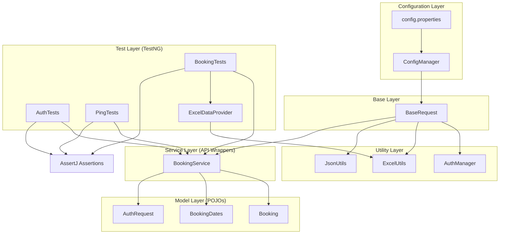
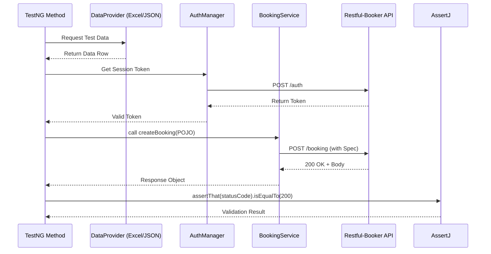

# 🚀 RICE-POT Rest Assured API Automation Framework

An enterprise-grade, layered API automation framework designed for the **Restful-Booker API**. This project demonstrates advanced SDET patterns, strict anti-hallucination verification, and a production-ready CI/CD pipeline.

---

## 🗺️ Architectural Blueprint

### Component Relationship Diagram
The framework uses a strictly decoupled architecture to ensure that changes in the API specification only require updates in the Model or Service layers, not the Test layer.

### Test Execution Flow
This flowchart illustrates the lifecycle of a typical authenticated test case.

---

## 🏗️ Layer Detail

### 1. Configuration Layer (`/config`)
- **`config.properties`**: Externalizes environment data (Base URL, timeouts).
- **`ConfigManager`**: Singleton utility to load properties into memory, ensuring a single source of truth for environment settings.

### 2. Base Layer (`/base`)
- **`BaseRequest`**: Centralizes the `RequestSpecification`. Every request in the project inherits the same Content-Type, Accept headers, and Base URI, preventing redundant configuration in service methods.

### 3. Utility Layer (`/utils`)
- **`AuthManager`**: Abstracts the complexity of authentication. Handles token generation and Basic Auth header encoding.
- **`ExcelUtils` & `JsonUtils`**: Generic wrappers around Apache POI and Jackson to transform external files into Java objects.

### 4. Model Layer (`/models`)
- **POJOs**: Using Java 17 records/classes to map JSON requests and responses.
- **`Booking` & `BookingDates`**: Represents the core domain entity for the Restful-Booker system.

### 5. Service Layer (`/services`)
- **`BookingService`**: The "API Client". It translates business actions (e.g., `deleteBooking`) into HTTP calls. This layer isolates the tests from the underlying Rest Assured implementation.

### 6. Test Layer (`/tests`)
- **TestNG Suites**: Organizes tests into logical groups (Ping, Auth, Booking).
- **AssertJ**: Uses fluent assertions for high readability (e.g., `assertThat(response).isNotNull()`).
- **Data-Driven Testing**: Integrated via `ExcelDataProvider` to run the same scenario across multiple datasets.

---

## 🛠️ Technical Stack

| Tool | Version | Purpose |
| :--- | :--- | :--- |
| **Java** | 17 | Runtime Language |
| **Rest Assured** | 5.3.0 | HTTP Client & Validation |
| **TestNG** | 7.7.0 | Test Execution & Suite Management |
| **AssertJ** | 3.24.2 | Fluent Assertions |
| **Jackson** | 2.15.2 | JSON $\leftrightarrow$ POJO Mapping |
| **Apache POI** | 5.2.3 | Excel Data Parsing |
| **Allure** | 2.24.0 | Rich Visual Reporting |
| **Maven** | 3.8+ | Dependency & Build Management |
| **GitHub Actions** | - | CI/CD Pipeline |

---

## 🚀 Setup & Execution

### Quick Start
1. **Clone**: `git clone <repo-url>`
2. **Config**: Edit `src/test/resources/config.properties` to match your target environment.
3. **Install**: `mvn clean install`

### Running Tests
- **Full Suite**: `mvn test`
- **Specific Suite**: `mvn test -DsuiteXmlFiles=src/test/resources/testng.xml`

### Viewing Reports
- **Allure**: `allure serve target/allure-results`

---

## ⚙️ CI/CD Pipeline
The project includes a `.github/workflows/api-tests.yml` file that automates the following:
1. **Trigger**: Every push to the `main` branch.
2. **Environment**: Ubuntu-latest with JDK 17.
3. **Caching**: Caches Maven dependencies to speed up builds.
4. **Execution**: Runs `mvn test`.
5. **Artifacts**: Uploads `allure-results` as build artifacts for post-run analysis.

---

## 🛡️ Quality Assurance Rules
This project strictly adheres to **Anti-Hallucination Rules**:
- **Zero Invention**: No endpoints or fields are assumed; everything is traced back to the provided API Test Case document.
- **Deterministic**: Tests are designed to be repeatable and independent.
- **Traceability**: Each `@Test` method description maps directly to a Test Case ID (e.g., `TC_BOOKING_CREATE_001`).
